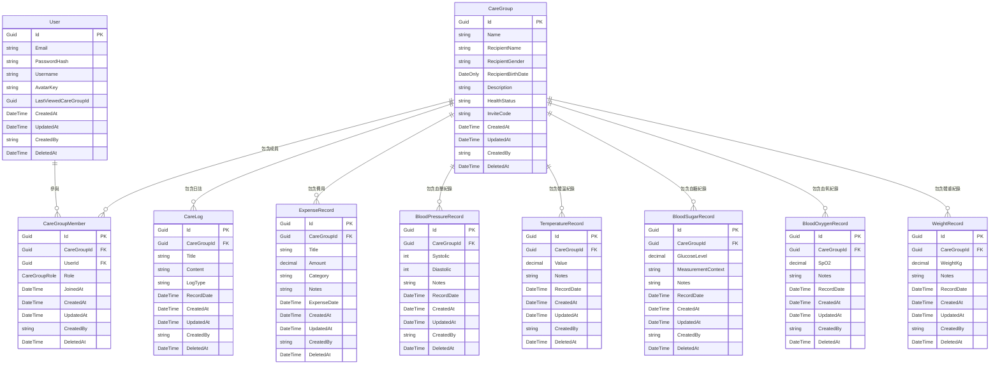

# 目前專案資料架構圖 (ER Diagram)

此圖表基於現有 C# Entities 與 Database Standards 自動梳理而成。包含了軟刪除 (`DeletedAt`) 以及審計欄位 (`CreatedAt`, `UpdatedAt`, `CreatedBy`)。

```mermaid
erDiagram
    %% 用戶與權限
    User {
        Guid Id PK
        string Email
        string PasswordHash
        string Username
        string AvatarKey
        Guid LastViewedCareGroupId
        DateTime CreatedAt
        DateTime UpdatedAt
        string CreatedBy
        DateTime DeletedAt
    }

    CareGroupMember {
        Guid Id PK
        Guid CareGroupId FK
        Guid UserId FK
        CareGroupRole Role
        DateTime JoinedAt
        DateTime CreatedAt
        DateTime UpdatedAt
        string CreatedBy
        DateTime DeletedAt
    }

    %% 核心小組架構
    CareGroup {
        Guid Id PK
        string Name
        string RecipientName
        string RecipientGender
        DateOnly RecipientBirthDate
        string Description
        string HealthStatus
        string InviteCode
        DateTime CreatedAt
        DateTime UpdatedAt
        string CreatedBy
        DateTime DeletedAt
    }

    %% 小組活動與日誌
    CareLog {
        Guid Id PK
        Guid CareGroupId FK
        string Title
        string Content
        string LogType
        DateTime RecordDate
        DateTime CreatedAt
        DateTime UpdatedAt
        string CreatedBy
        DateTime DeletedAt
    }

    ExpenseRecord {
        Guid Id PK
        Guid CareGroupId FK
        string Title
        decimal Amount
        string Category
        string Notes
        DateTime ExpenseDate
        DateTime CreatedAt
        DateTime UpdatedAt
        string CreatedBy
        DateTime DeletedAt
    }

    %% 健康與體徵紀錄
    BloodPressureRecord {
        Guid Id PK
        Guid CareGroupId FK
        int Systolic
        int Diastolic
        string Notes
        DateTime RecordDate
        DateTime CreatedAt
        DateTime UpdatedAt
        string CreatedBy
        DateTime DeletedAt
    }

    TemperatureRecord {
        Guid Id PK
        Guid CareGroupId FK
        decimal Value
        string Notes
        DateTime RecordDate
        DateTime CreatedAt
        DateTime UpdatedAt
        string CreatedBy
        DateTime DeletedAt
    }

    BloodSugarRecord {
        Guid Id PK
        Guid CareGroupId FK
        decimal GlucoseLevel
        string MeasurementContext
        string Notes
        DateTime RecordDate
        DateTime CreatedAt
        DateTime UpdatedAt
        string CreatedBy
        DateTime DeletedAt
    }

    BloodOxygenRecord {
        Guid Id PK
        Guid CareGroupId FK
        decimal SpO2
        string Notes
        DateTime RecordDate
        DateTime CreatedAt
        DateTime UpdatedAt
         string CreatedBy
        DateTime DeletedAt
    }

    WeightRecord {
        Guid Id PK
        Guid CareGroupId FK
        decimal WeightKg
        string Notes
        DateTime RecordDate
        DateTime CreatedAt
        DateTime UpdatedAt
        string CreatedBy
        DateTime DeletedAt
    }

    %% 關聯定義
    User ||--o{ CareGroupMember : "參與"
    CareGroup ||--o{ CareGroupMember : "包含成員"
    CareGroup ||--o{ CareLog : "包含日誌"
    CareGroup ||--o{ ExpenseRecord : "包含費用"
    CareGroup ||--o{ BloodPressureRecord : "包含血壓紀錄"
    CareGroup ||--o{ TemperatureRecord : "包含體溫紀錄"
    CareGroup ||--o{ BloodSugarRecord : "包含血糖紀錄"
    CareGroup ||--o{ BloodOxygenRecord : "包含血氧紀錄"
    CareGroup ||--o{ WeightRecord : "包含體重紀錄"
```
