# Seasons Care 資料庫架構圖 (ER Diagram)

這份文件展示了 `Seasons Care` 專案目前的實體關聯模型 (Entity-Relationship Diagram)。我們採用 `CareGroup` 作為租戶隔離 (Multi-Tenancy) 的核心，所有的照護資料（如日誌、花費、健康數值）都必定綁定一個 `CareGroupId`。

## Mermaid ER 圖表

如果你使用的外掛或是其他 AI Agent 支援 Mermaid 語法，可以直接讀取或貼上以下代碼來產生圖表。

```mermaid
erDiagram
    %% Core Relationships
    Users ||--o{ CareGroupMembers : "參與"
    CareGroups ||--o{ CareGroupMembers : "包含"
    
    %% Multi-tenancy Data Isolation
    CareGroups ||--o{ CareLogs : "擁有 (tenant)"
    CareGroups ||--o{ ExpenseRecords : "擁有 (tenant)"
    CareGroups ||--o{ BloodPressures : "擁有 (tenant)"
    CareGroups ||--o{ BloodSugars : "擁有 (tenant)"
    CareGroups ||--o{ BloodOxygens : "擁有 (tenant)"
    CareGroups ||--o{ Temperatures : "擁有 (tenant)"
    CareGroups ||--o{ Weights : "擁有 (tenant)"

    %% Entities
    Users {
        uuid Id PK
        string Email
        string Name
        string PasswordHash
        datetime CreatedAt
    }
    
    CareGroups {
        uuid Id PK
        string Name
        string Description
        datetime CreatedAt
        boolean IsDeleted
    }

    CareGroupMembers {
        uuid Id PK
        uuid CareGroupId FK
        uuid UserId FK
        string Role "Owner / Member"
    }

    CareLogs {
        uuid Id PK
        uuid CareGroupId FK
        string Title
        string Content
        datetime CreatedAt
        boolean IsDeleted
    }

    ExpenseRecords {
        uuid Id PK
        uuid CareGroupId FK
        decimal Amount
        string Description
        datetime CreatedAt
        boolean IsDeleted
    }

    %% Health Records Modules
    BloodPressures {
        uuid Id PK
        uuid CareGroupId FK
        int Systolic "收縮壓"
        int Diastolic "舒張壓"
        int Pulse "脈搏"
        datetime RecordTime
    }

    BloodSugars {
        uuid Id PK
        uuid CareGroupId FK
        float SugarLevel "血糖值"
        string MeasurementTiming "飯前/飯後..."
        datetime RecordTime
    }

    BloodOxygens {
        uuid Id PK
        uuid CareGroupId FK
        float SpO2 "血氧濃度"
        datetime RecordTime
    }

    Temperatures {
        uuid Id PK
        uuid CareGroupId FK
        float TemperatureCelsius "體溫 (°C)"
        datetime RecordTime
    }
    
    Weights {
        uuid Id PK
        uuid CareGroupId FK
        float WeightKg "體重 (kg)"
        datetime RecordTime
    }
```

## 架構說明 (Architecture Notes)
1. **多租戶隔離 (Multi-Tenancy)**：除了 `Users` 屬於全域資料外，其餘透過 `IMultiTenantEntity` 介面封裝的實體皆包含 `CareGroupId` 作為 Foreign Key。系統底層透過 Middleware 與 EF Core Global Query Filter 來自動隔離不同群組間的資料。
2. **軟刪除 (Soft Delete)**：大部分的紀錄（包含 `CareGroup`、`CareLog` 等）實作了 `ISoftDeleteEntity` 介面，在刪除時只會更新 `IsDeleted = true` 欄位，保留稽核軌跡而不會實體刪除。
3. **對多連動**：一個使用者可以加入多個 `CareGroup`，而一個 `CareGroup` 可以容納多位家庭成員。
